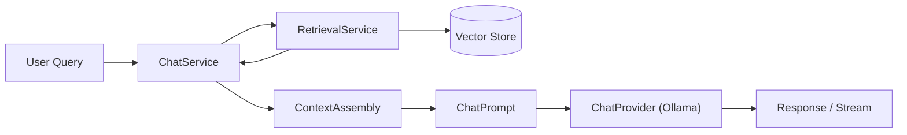
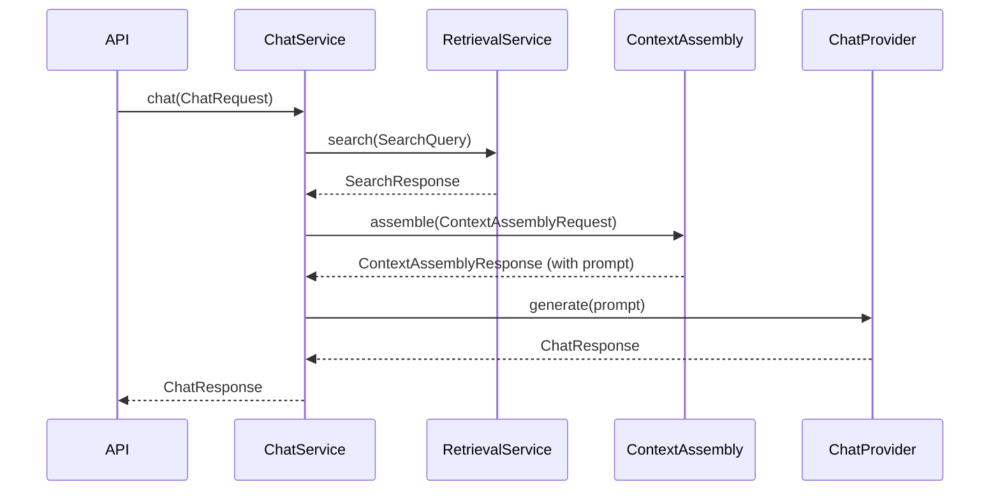

# Chat Subsystem

> **Status:** Complete
> **Sprint Introduced:** Sprint 6
> **Last Updated:** Sprint 12.1
> **Reading Time:** 4 minutes
> **Audience:** Backend contributors
> **Prerequisites:** [Retrieval](retrieval.md)
> **Related ADRs:** ADR-0012, ADR-0017
> **Related APIs:** `POST /chat`, `GET /chat/stream`
> **Next Reading:** [Editing](editing.md)

---

## Executive Summary

The Chat subsystem provides repository-aware conversational AI. It retrieves semantically relevant content from the indexed repository, assembles it into a prompt with retrieved context, and generates responses via a local LLM. Chat never indexes — it only retrieves.

---

## Responsibilities

- Query-based semantic retrieval (via `RetrievalService`)
- Context assembly (retrieved content → structured prompt)
- LLM interaction (text generation and streaming via `ChatProvider`)
- Conversation state management

---

## Ownership Boundaries

| Owned | Not Owned |
|-------|-----------|
| Conversational AI | Repository indexing |
| Context assembly integration | Embedding generation |
| Prompt construction | Vector storage |
| LLM interaction | Repository scanning |
| Streaming responses | Filesystem writes |
| — | Vector search (delegated to Retrieval) |

---

## Architecture

---

## Lifecycle: Chat Request

---

## Key Files

### ChatService

- **File:** `app/chat/service.py`
- **Dependencies:** `RetrievalService`, `ContextAssembly`, `ChatProvider`
- **Methods:**
  - `chat(request: ChatRequest) -> ChatResponse` — retrieve, assemble, generate
  - `stream(request: ChatRequest) -> Iterator[ChatChunk]` — streaming variant

### ContextAssembly (Interface)

- **File:** `app/context_assembly/providers.py`
- **Method:** `assemble(request: ContextAssemblyRequest) -> ContextAssemblyResponse`

### DefaultContextAssembly

- **File:** `app/context_assembly/service.py`
- Builds a `ChatPrompt` with system instruction + retrieved context + user query

### ChatPrompt

- **File:** `app/chat/models.py`
- Contains a list of `ChatMessage` objects (role + content)

### ChatProvider (Interface)

- **File:** `app/chat/providers.py`
- **Methods:** `generate(prompt) -> ChatResponse`, `stream(prompt) -> Iterator[ChatChunk]`

### OllamaChatProvider

- **File:** `app/chat/ollama_provider.py`
- Default implementation communicating with local Ollama instance

---

## Invariants

> [!IMPORTANT]

1. **Chat never indexes.** `ChatService` consumes retrieval results but never calls `IndexingService`.
2. **Chat never modifies files.** Repository modification belongs exclusively to the Editing subsystem.
3. **Prompt construction is owned by ContextAssembly**, not by ChatService.
4. **ChatProvider is an abstraction** — ChatService is not coupled to Ollama specifically.

---

## Extension Points

| Point | Mechanism | Example |
|-------|-----------|---------|
| Chat provider | Implement `ChatProvider` | Switch to a different LLM backend |
| Context assembly | Implement `ContextAssembly` | Custom prompt templates |
| Streaming | Uses `Iterator[ChatChunk]` | SSE events to frontend |

> [!TIP] To add a new LLM backend: implement `ChatProvider` and register it in `providers.py`. No chat service or context assembly changes are needed.

---

## Why This Design

Chat is intentionally decoupled from indexing. Project initialization ensures indexing is complete before chat begins, but chat itself never triggers indexing. This prevents accidental performance issues and keeps the architectural boundary clear.

Context assembly is a separate abstraction because prompt construction strategy may evolve independently of chat orchestration.

---

## Known Limitations

- No conversation history management beyond a single request-response cycle
- No streaming chat in the API (backlog — SSE endpoint is defined but not wired)
- Context assembly uses a fixed prompt template — no customization exposed

---

## Related Documents

| Document | Link |
|----------|------|
| Retrieval | [retrieval.md](retrieval.md) |
| Editing | [editing.md](editing.md) |
| Storage | [storage.md](storage.md) |
| System Overview | [../system-overview.md](../system-overview.md) |
| ADR-0012 | [../../adr/adr-0012-repository-aware-chat.md](../../adr/adr-0012-repository-aware-chat.md) |
| ADR-0017 | [../../adr/adr-0017-prompt-construction.md](../../adr/adr-0017-prompt-construction.md) |
