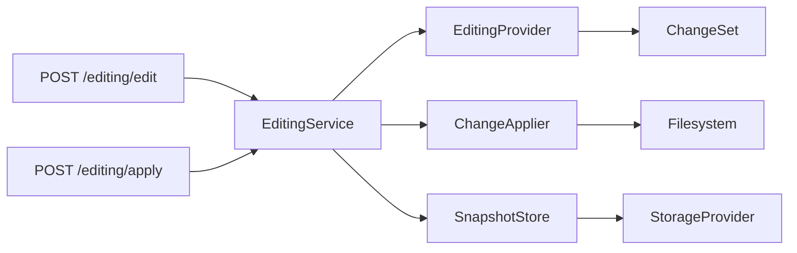
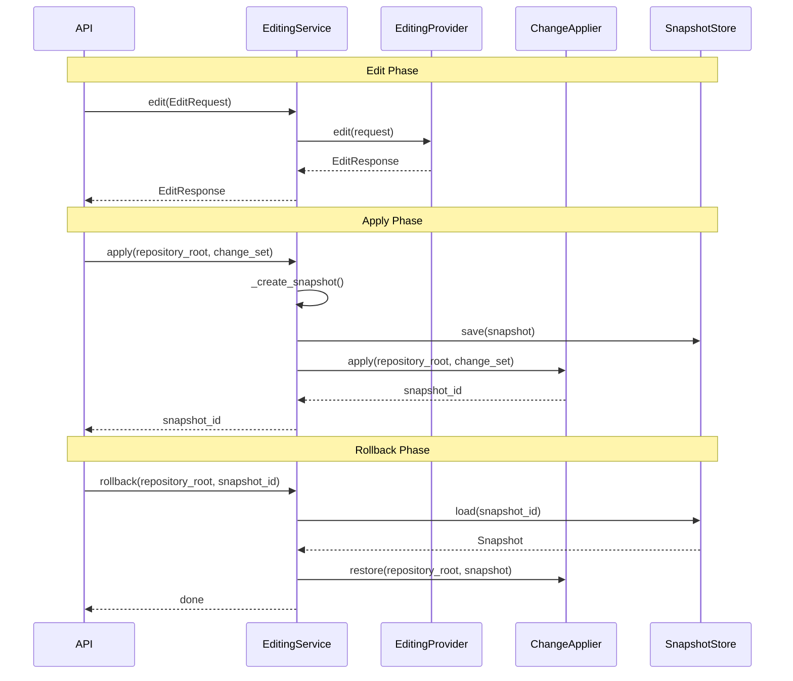

# Editing Subsystem

> **Status:** Complete
> **Sprint Introduced:** Sprint 8
> **Last Updated:** Sprint 12.1
> **Reading Time:** 4 minutes
> **Audience:** Backend contributors
> **Prerequisites:** [System Overview](../system-overview.md)
> **Related ADRs:** ADR-0010
> **Related APIs:** `POST /editing/edit`, `POST /editing/apply`, `POST /editing/rollback`
> **Next Reading:** [Storage](storage.md)

---

## Executive Summary

The Editing subsystem performs controlled source-code modifications. It generates patches via an AI provider, applies changes with automatic snapshot creation, and supports rollback to any previous state. Editing is the exclusive owner of repository modification — no other subsystem may write to the repository.

---

## Responsibilities

- Patch generation (via `EditingProvider`)
- Change application to repository files
- Snapshot creation before modification
- Snapshot persistence and rollback
- Diff preview

---

## Ownership Boundaries

| Owned | Not Owned |
|-------|-----------|
| Repository modification | Repository scanning |
| Snapshot creation | Metadata extraction |
| Change application | Semantic indexing |
| Rollback | Embedding generation |
| — | Vector search |

---

## Architecture

---

## Lifecycle: Edit → Apply → Rollback

---

## Key Files

### EditingService

- **File:** `app/editing/service.py`
- **Dependencies:** `EditingProvider`, `ChangeApplier`, `SnapshotStore`
- **Methods:**
  - `edit(request: EditRequest) -> EditResponse` — generate proposed changes
  - `apply(repository_root, change_set) -> snapshot_id` — apply + snapshot
  - `rollback(repository_root, snapshot_id) -> None` — restore snapshot

### EditingProvider (Interface)

- **File:** `app/editing/providers.py`
- **Method:** `edit(request: EditRequest) -> EditResponse`

### ChangeApplier

- **File:** `app/editing/change_applier.py`
- **Methods:**
  - `apply(repository_root, change_set)` — write changes to disk
  - `restore(repository_root, snapshot)` — revert files to snapshot state

### SnapshotStore

- **File:** `app/editing/snapshot_store.py`
- **Dependencies:** `StorageProvider`
- **Methods:** `save(snapshot)`, `load(snapshot_id) -> Snapshot`

---

## Invariants

> [!IMPORTANT]

1. **Editing is the sole owner of repository modification.** No other subsystem may write to the repository.
2. **All modifications are reversible.** Every `apply()` call creates a snapshot before making changes.
3. **Snapshot content is captured before modification.** If a file doesn't exist, snapshot stores empty content.
4. Editing never performs repository analysis — it only modifies.

---

## Extension Points

| Point | Mechanism | Example |
|-------|-----------|---------|
| Editing provider | Implement `EditingProvider` | Custom patch generation strategy |
| Snapshot storage | Modify `SnapshotStore` | Alternative snapshot backend |
| Change application | Modify `ChangeApplier` | Additional safety checks |

---

## Why This Design

The three-phase design (edit → review → apply) separates AI-generated changes from execution. Snapshots provide a safety net — every modification is reversible. The `EditingProvider` abstraction allows the patch generation strategy to evolve independently of the application and rollback mechanics.

---

## Known Limitations

- Snapshot IDs are returned to the caller but there's no endpoint to list snapshots.
- No snapshot cleanup strategy — snapshots accumulate indefinitely.
- `edit()` returns AI suggestions; the caller must explicitly call `apply()` to execute them.

---

## Related Documents

| Document | Link |
|----------|------|
| Storage | [storage.md](storage.md) |
| System Overview | [../system-overview.md](../system-overview.md) |
| ADR-0010 | [../../adr/adr-0010-filesystem-persistence.md](../../adr/adr-0010-filesystem-persistence.md) |
| API Reference | [../../api/](../../api/) |
