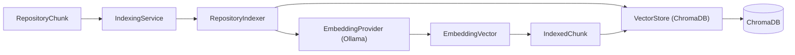
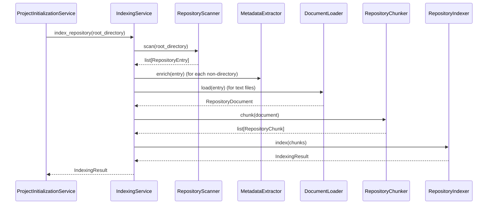

# Indexing Subsystem

> **Status:** Complete
> **Sprint Introduced:** Sprint 4
> **Last Updated:** Sprint 12.1
> **Reading Time:** 4 minutes
> **Audience:** Backend contributors
> **Prerequisites:** [Repository](repository.md)
> **Related ADRs:** ADR-0003, ADR-0016
> **Related APIs:** `POST /projects/open` (triggers indexing)
> **Next Reading:** [Retrieval](retrieval.md)

---

## Executive Summary

The Indexing subsystem converts repository chunks into searchable semantic representations. It generates embeddings using a local model and persists them through a vector store. Indexing is triggered automatically during project open (via `ProjectInitializationService`) or can be run independently.

---

## Responsibilities

- Embedding generation via local models (`nomic-embed-text` through Ollama)
- `IndexedChunk` construction (chunk + embedding)
- Vector persistence coordination (delegated to `VectorStore`)
- Indexing result reporting

---

## Ownership Boundaries

| Owned | Not Owned |
|-------|-----------|
| Embedding generation | Repository scanning |
| Indexed chunk assembly | Metadata extraction |
| Indexing orchestration | Vector search |
| Indexing result reporting | Prompt construction |
| — | Repository modification |

---

## Architecture

---

## Lifecycle: Indexing Pipeline

---

## Key Files

### IndexingService

- **File:** `app/indexing/service.py`
- **Methods:**
  - `index_repository(root_directory: Path) -> IndexingResult` — scan, enrich, load, chunk, index
- Tracks: `scanned_files`, `indexed_files`, `indexed_chunks`, `skipped_files`, `failed_files`

### RepositoryIndexer

- **File:** `app/indexing/indexer.py`
- **Dependencies:** `EmbeddingProvider`, `VectorStore`
- **Methods:**
  - `index(chunks: Sequence[RepositoryChunk]) -> IndexingResult` — embed + store

### IndexingResult

- **File:** `app/indexing/models.py`
- Fields: `scanned_files`, `indexed_files`, `indexed_chunks`, `skipped_files`, `failed_files`

---

## Invariants

> [!IMPORTANT]

1. Indexing **never performs retrieval**. The retrieval subsystem is a separate consumer of the vector store.
2. Indexing **never owns vector persistence logic**. Persistence is delegated to `VectorStore`.
3. `IndexingResult` is the sole output contract — callers receive summary counts.
4. Indexing skips directories and non-text files silently.

---

## Extension Points

| Point | Mechanism | Example |
|-------|-----------|---------|
| Embedding provider | Implement `EmbeddingProvider` | Switch to a different local model |
| Vector store | Implement `VectorStore` | Use PostgreSQL + pgvector |
| Indexing pipeline | Modify `IndexingService.index_repository()` | Add pre/post processing steps |

> [!TIP] To add a new embedding model: implement `EmbeddingProvider` and update the provider function in `app/dependencies/providers.py`. No other subsystem changes are needed.

---

## Why This Design

Embedding generation and vector persistence are separated through `EmbeddingProvider` and `VectorStore` interfaces. This allows each to evolve independently. The `RepositoryIndexer` coordinates the two without being coupled to any specific implementation.

Indexing is independent of retrieval by design — `RetrievalService` never indexes, and `IndexingService` never searches. This prevents circular dependencies and keeps each subsystem testable in isolation.

---

## Known Limitations

- Indexing processes all text files synchronously. For very large repositories this can be slow.
- Failed files are counted but not identified (no per-file error reporting in `IndexingResult`).
- No incremental indexing — the entire repository is re-indexed each time.

---

## Related Documents

| Document | Link |
|----------|------|
| Repository | [repository.md](repository.md) |
| Retrieval | [retrieval.md](retrieval.md) |
| Storage | [storage.md](storage.md) |
| Project Management | [project-management.md](project-management.md) |
| ADR-0003 | [../../adr/adr-0003-indexing-ownership.md](../../adr/adr-0003-indexing-ownership.md) |
| ADR-0016 | [../../adr/adr-0016-embedding-model-selection.md](../../adr/adr-0016-embedding-model-selection.md) |
