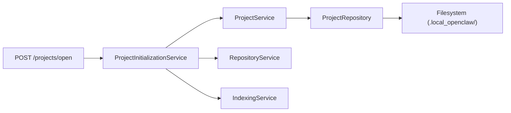
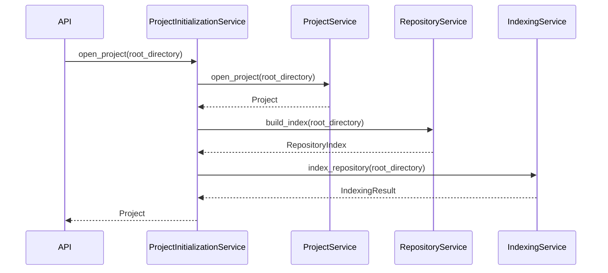

# Project Management Subsystem

> **Status:** Complete
> **Sprint Introduced:** Sprint 4
> **Last Updated:** Sprint 13
> **Reading Time:** 4 minutes
> **Audience:** Backend contributors
> **Prerequisites:** [System Overview](../system-overview.md)
> **Related ADRs:** ADR-0009, ADR-0011, ADR-0013, ADR-0010
> **Related APIs:** `POST /projects/open`, `GET /projects/info`
> **Next Reading:** [Repository](repository.md)

---

## Executive Summary

Project Management owns the project lifecycle from opening through initialization. It validates the project directory, persists project metadata, and — since Sprint 12.1 — orchestrates repository indexing so that projects are fully initialized on open.

---

## Responsibilities

- Validate project root directory (exists, is a directory, is accessible)
- Persist project metadata (name, root directory, storage directory, creation timestamp)
- Retrieve project metadata on request
- Orchestrate repository indexing during project open

---

## Ownership Boundaries

| Owned | Not Owned |
|-------|-----------|
| Project lifecycle | Repository scanning |
| Project validation | Metadata extraction |
| Project metadata persistence | Semantic indexing |
| Initialization orchestration | Embedding generation |
| — | Vector storage |

---

## Architecture

---

## Lifecycle: Project Open

> [!NOTE] `ProjectInitializationService` delegates all work. It contains no business logic beyond sequencing.

---

## Key Files

### ProjectService

- **File:** `app/projects/service.py`
- **Responsibilities:** Project validation (`Path.exists()`, `Path.is_dir()`), `Project` object construction, metadata persistence via `ProjectRepository`
- **Methods:**
  - `open_project(root_directory: Path) -> Project` — validate and persist
  - `get_project(root_directory: Path) -> Project` — load existing metadata

### ProjectInitializationService

- **File:** `app/projects/initialization_service.py`
- **Introduced:** Sprint 12.1
- **Responsibilities:** Orchestrate `ProjectService.open_project()` → `RepositoryService.build_index()` → `IndexingService.index_repository()`
- **Methods:**
  - `open_project(root_directory: Path) -> Project` — full initialization pipeline

### ProjectRepository

- **File:** `app/projects/repository.py`
- **Responsibilities:** Save/load `Project` metadata as JSON in `.local_openclaw/`

---

## Invariants

> [!IMPORTANT]

1. A project must be persisted **before** indexing begins. `ProjectService.open_project()` runs first.
2. Project identity is derived from the root directory path. Two opens of the same directory produce the same project name.
3. Storage directory is always `<root_directory>/.local_openclaw/` — persistence identity comes from the opened project, never the process working directory.
4. `ProjectInitializationService` must never contain business logic — only orchestration.

---

## Extension Points

- Adding new lifecycle stages: modify `ProjectInitializationService.open_project()` to call additional services.
- Custom storage backends: implement `StorageProvider` (see [Storage](storage.md)).

---

## Why This Design

Before Sprint 12.1, `POST /projects/open` only called `ProjectService.open_project()`. The user had to separately trigger indexing. This was decoupled but required manual effort.

`ProjectInitializationService` was introduced to automate the pipeline while preserving subsystem boundaries. Each existing service remained unchanged — only a new orchestration layer was added.

---

## Known Limitations

- `build_index()` and `index_repository()` each independently scan the filesystem. Work is duplicated between the two calls. This is a known architectural property of the two services — they do not share state. See [ADR-0014](../adr/adr-0014-repository-scan-ownership.md).

---

## Related Documents

| Document | Link |
|----------|------|
| Repository | [repository.md](repository.md) |
| Indexing | [indexing.md](indexing.md) |
| Storage | [storage.md](storage.md) |
| System Overview | [../system-overview.md](../system-overview.md) |
| ADR-0009 | [../../adr/adr-0009-project-initialization-service.md](../../adr/adr-0009-project-initialization-service.md) |
| API Reference | [../../api/](../../api/) |
