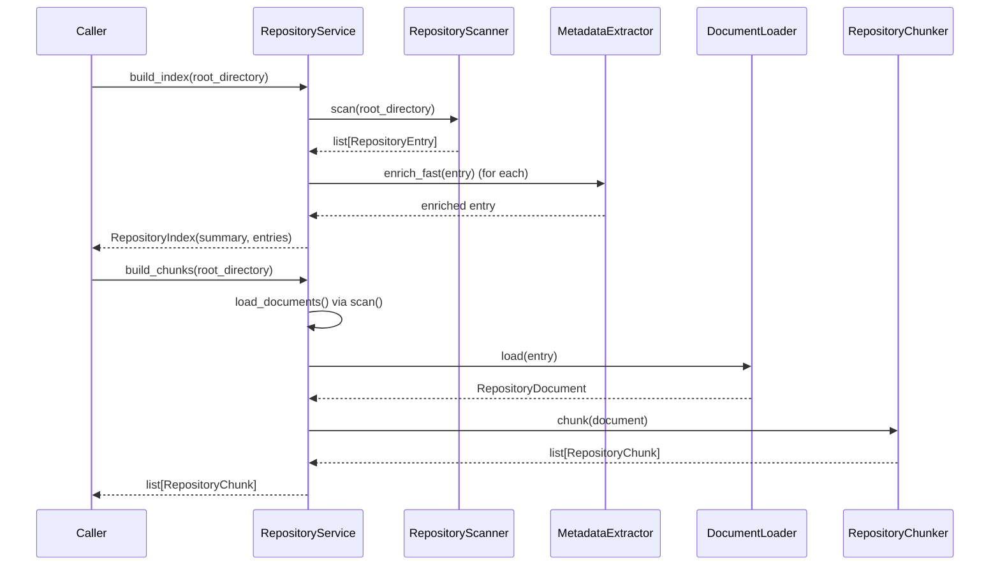

# Repository Subsystem

> **Status:** Complete
> **Sprint Introduced:** Sprint 4
> **Last Updated:** Sprint 12.1
> **Reading Time:** 5 minutes
> **Audience:** Backend contributors
> **Prerequisites:** [System Overview](../system-overview.md)
> **Related ADRs:** ADR-0002, ADR-0014, ADR-0015
> **Related APIs:** `GET /repository/index`, `GET /repository/scan`, `GET /repository/summary`
> **Next Reading:** [Indexing](indexing.md)

---

## Executive Summary

The Repository subsystem constructs a structured, deterministic understanding of a software repository. It is the foundational subsystem — all repository-aware functionality depends on its output. It scans the filesystem, extracts metadata, loads documents, and produces chunks that downstream subsystems consume for indexing and retrieval.

---

## Responsibilities

- Directory traversal with ignore-rule handling
- Fast and slow metadata extraction (file type, language, size, hashing, MIME)
- Text document loading
- Language detection
- AST-aware chunking (Python) with line-based fallback for all other languages
- Deterministic chunk identifier generation

---

## Ownership Boundaries

| Owned | Not Owned |
|-------|-----------|
| Filesystem scanning | Embedding generation |
| Metadata extraction | Semantic retrieval |
| Document loading | Vector storage |
| Chunk generation | AI inference |
| Chunk ID generation | Prompt construction |
| Ignore-rule handling | Repository modification |

---

## Architecture

---

## Lifecycle: Repository Build

---

## Key Files

### RepositoryService

- **File:** `app/repository/service.py`
- **Public API:**
  - `build_index(root_directory) -> RepositoryIndex` — scan + fast enrich + summary
  - `scan(root_directory) -> list[RepositoryEntry]` — convenience wrapper
  - `summary(root_directory) -> RepositorySummary` — convenience wrapper
  - `load_documents(root_directory) -> list[RepositoryDocument]`
  - `build_chunks(root_directory) -> list[RepositoryChunk]`
  - `build_manifest(root_directory) -> RepositoryManifest`

### RepositoryScanner

- **File:** `app/repository/scanner.py`
- Traverses directory tree, applies ignore rules, returns `RepositoryEntry` objects

### RepositoryMetadataExtractor

- **File:** `app/repository/metadata.py`
- `enrich_fast(entry)` — size, MIME, language detection, text file flag
- `enrich(entry)` — slower metadata (SHA-256)
- `enrich_slow(entry)` — additional analysis

### RepositoryDocumentLoader

- **File:** `app/repository/documents.py`
- Reads text file content, returns `RepositoryDocument` with line count

### RepositoryChunker

- **File:** `app/repository/chunking.py`
- Routes to language-specific algorithm or line-based default
- Python AST chunking via `PythonAstChunkAlgorithm`
- Supports `register_algorithm(language, algorithm)` for extension

---

## Invariants

> [!IMPORTANT]

1. Scanning is **stateless** — results are computed fresh each call.
2. Chunk identifiers are **deterministic** — content-addressed via SHA-256.
3. No semantic understanding leaves this subsystem raw. Downstream subsystems consume `RepositoryChunk` only.
4. Metadata extraction has two paths: `enrich_fast` (for `build_index`) and `enrich` (for indexing). They serve different consumers.

---

## Extension Points

| Point | Mechanism | Example |
|-------|-----------|---------|
| Language chunking | `RepositoryChunker.register_algorithm()` | Adding Rust AST chunking |
| Metadata enrichment | Implement additional extractor methods | Custom file-type analysis |
| Ignore rules | Extend `RepositoryScanner` ignore logic | Additional ignore patterns |

> [!TIP] To add a new language: implement `ChunkAlgorithm`, register it via `register_algorithm(language, algorithm)`. No other subsystem changes are required.

---

## Why This Design

Repository understanding is separated from indexing and retrieval so that each subsystem can evolve independently. `build_index()` produces summary metadata quickly (fast path), while `index_repository()` (in Indexing) performs the full slow-path enrichment. This separation means the repository index endpoint is fast even if indexing hasn't completed.

The chunking registry pattern was chosen over a single algorithm to support incremental language addition without modifying the chunker core.

---

## Known Limitations

- `build_index()` and `IndexingService.index_repository()` each scan the filesystem independently. They do not share scan results. See [ADR-0014](../../adr/adr-0014-repository-scan-ownership.md).
- Line-based chunking may produce semantically suboptimal boundaries for languages other than Python.

---

## Related Documents

| Document | Link |
|----------|------|
| System Overview | [../system-overview.md](../system-overview.md) |
| Indexing | [indexing.md](indexing.md) |
| Project Management | [project-management.md](project-management.md) |
| ADR-0002 | [../../adr/adr-0002-repository-ownership.md](../../adr/adr-0002-repository-ownership.md) |
| ADR-0014 | [../../adr/adr-0014-repository-scan-ownership.md](../../adr/adr-0014-repository-scan-ownership.md) |
| ADR-0015 | [../../adr/adr-0015-chunking-strategy.md](../../adr/adr-0015-chunking-strategy.md) |
