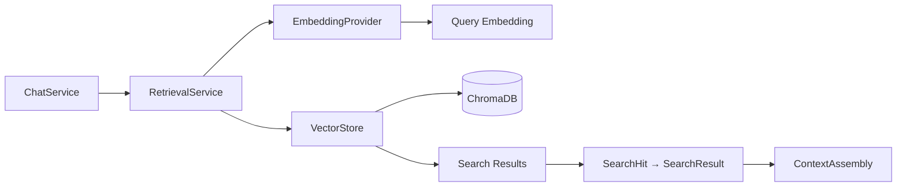
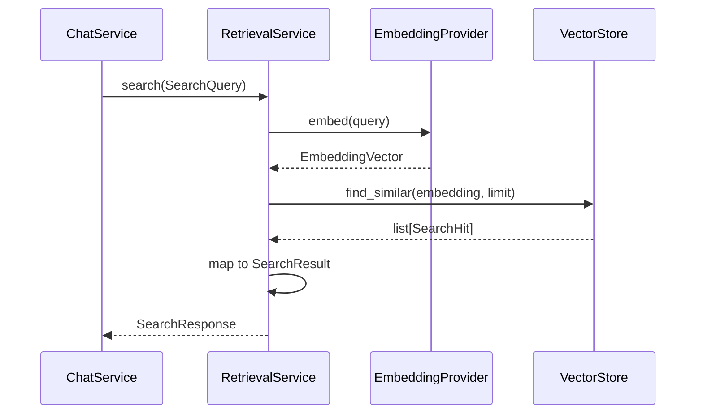

# Retrieval Subsystem

> **Status:** Complete
> **Sprint Introduced:** Sprint 5
> **Last Updated:** Sprint 12.1
> **Reading Time:** 4 minutes
> **Audience:** Backend contributors
> **Prerequisites:** [Indexing](indexing.md)
> **Related ADRs:** ADR-0004, ADR-0008
> **Related APIs:** `POST /chat` (uses retrieval internally)
> **Next Reading:** [Chat](chat.md)

---

## Executive Summary

The Retrieval subsystem performs semantic search over indexed repository content. It generates query embeddings and searches the vector store, returning ranked results. Retrieval is consumed by `ChatService` to provide repository-aware context — but retrieval itself remains independent of chat, indexing, and prompt construction.

---

## Responsibilities

- Query embedding generation (via `EmbeddingProvider`)
- Vector search orchestration (via `VectorStore`)
- Search result mapping to retrieval projections

---

## Ownership Boundaries

| Owned | Not Owned |
|-------|-----------|
| Query embedding | Indexing new content |
| Vector search | Vector persistence (delegated to VectorStore) |
| Search result transformation | Prompt construction |
| Retrieval projection models | Conversation state |
| — | Repository scanning |

---

## Architecture

---

## Lifecycle: Semantic Search

---

## Key Files

### RetrievalService

- **File:** `app/indexing/retrieval_service.py`
- **Dependencies:** `EmbeddingProvider`, `VectorStore`
- **Methods:**
  - `search(query: SearchQuery) -> SearchResponse` — embed query, search vector store, return results

### SearchQuery

- **File:** `app/indexing/retrieval_models.py`
- Fields: `query: str`, `limit: int` (default 10)

### SearchHit

- Raw result from vector store. Contains `chunk_id`, `content`, `metadata`, `boundary`, `vector_score`.

### SearchResult

- Transformed result for API consumers. Contains `chunk_id`, `content`, `metadata`, `boundary`, `similarity_score`.

### SearchResponse

- API response. Contains `query: str` and `results: list[SearchResult]`.

---

## Invariants

> [!IMPORTANT]

1. **Retrieval never indexes.** It never writes to the vector store — only reads.
2. **Retrieval never owns vector persistence.** `VectorStore` owns persistence.
3. `SearchHit` is a **projection**, independent of `IndexedChunk`. Changes to indexing models do not require changes to retrieval models.
4. Retrieval does not assemble prompts or interact with chat state.

---

## Extension Points

| Point | Mechanism | Example |
|-------|-----------|---------|
| Search strategy | Modify `RetrievalService.search()` | Add hybrid search (vector + keyword) |
| Result ranking | Modify result mapping | Custom scoring or filtering |
| Query transformation | Pre-process query before embedding | Query expansion |

> [!TIP] Retrieval is stateless. It can be called independently of chat for any application that needs semantic repository search.

---

## Why This Design

Retrieval is separated from indexing to prevent circular dependencies and to allow each to evolve independently. The `SearchHit` → `SearchResult` mapping provides a stable API projection that isolates consumers from internal vector store representation.

---

## Known Limitations

- Single search strategy (pure vector similarity). No hybrid or keyword search.
- No filtering by file path, language, or date.
- No pagination beyond the `limit` parameter.

---

## Related Documents

| Document | Link |
|----------|------|
| Indexing | [indexing.md](indexing.md) |
| Chat | [chat.md](chat.md) |
| Storage | [storage.md](storage.md) |
| System Overview | [../system-overview.md](../system-overview.md) |
| ADR-0004 | [../../adr/adr-0004-retrieval-boundaries.md](../../adr/adr-0004-retrieval-boundaries.md) |
| ADR-0008 | [../../adr/adr-0008-search-projection.md](../../adr/adr-0008-search-projection.md) |
