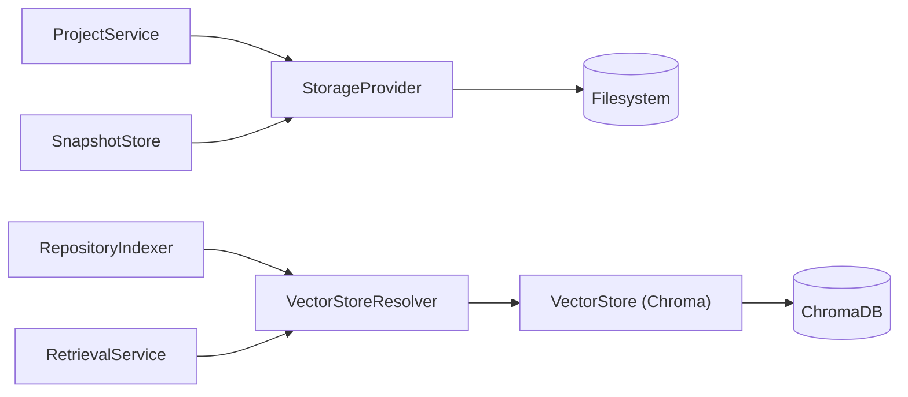

# Storage Subsystem

> **Status:** Complete
> **Sprint Introduced:** Sprint 4
> **Last Updated:** Sprint 13
> **Reading Time:** 3 minutes
> **Audience:** Backend contributors
> **Prerequisites:** [System Overview](../system-overview.md)
> **Related ADRs:** ADR-0006, ADR-0010
> **Next Reading:** [Frontend](../frontend/overview.md)

---

## Executive Summary

The Storage subsystem provides durable persistence for all application state. It owns the persistence mechanisms — not the business logic. Two storage abstractions exist: `StorageProvider` for filesystem-based data and `VectorStore` for vector data.

---

## Responsibilities

- Filesystem-based project metadata persistence
- Snapshot persistence (pre-edit file state)
- Configuration persistence
- Vector database persistence (via ChromaDB adapter)

---

## Ownership Boundaries

| Owned | Not Owned |
|-------|-----------|
| Filesystem I/O | Repository understanding |
| Vector persistence | Semantic search logic |
| Storage abstraction interfaces | Embedding generation |
| Configuration persistence | Business rules |
| — | Any form of business logic |

---

## Architecture



**Persistence identity (Sprint 13):** all project-local persistence — project metadata, vectors, and snapshots — lives under `<project root>/.local_openclaw/` and is derived from the opened project, never from the process working directory:

```
<project root>/.local_openclaw/
├── project.json        (project metadata)
├── index/chroma/       (ChromaDB vectors)
└── snapshots/          (pre-edit file state)
```

---

## Key Files

### StorageProvider (Interface)

- **File:** `app/core/storage/abstractions.py`
- Abstract persistence interface for project state and snapshots

### FileSystemStorage

- **File:** `app/core/storage/filesystem.py`
- Default implementation using the local filesystem
- Root directory is project-scoped: `<project root>/.local_openclaw/` (see `app/core/storage/locations.py` and [ADR-0010](../../adr/adr-0010-filesystem-persistence.md)) — not a configurable global setting

### VectorStore (Interface)

- **File:** `app/indexing/stores.py`
- Abstract vector persistence interface
- Methods: `index(chunks)`, `find_similar(embedding, limit, where) -> list[SearchHit]`

### VectorStoreResolver

- **File:** `app/indexing/store_resolver.py`
- Resolves the `VectorStore` for a project root: persistence identity comes from the opened project, never the process CWD
- Implementation: `ProjectChromaStoreResolver`

### ChromaVectorStore

- **File:** `app/indexing/chroma_store.py`
- ChromaDB adapter implementing `VectorStore`
- Constructor: `(persist_directory: Path, collection_name: str)`; persist directory derived from the project root (`<root>/.local_openclaw/index/chroma`)
- `Collection name` comes from `settings.chroma.collection_name` (default `repository_chunks`); the persist directory is intentionally not configurable (see [ADR-0010](../../adr/adr-0010-filesystem-persistence.md))
- `close()` stops the ChromaDB system and releases file handles (Windows-safe directory removal)

---

## Invariants

> [!IMPORTANT]

1. **Storage never contains business logic.** It reads and writes data — it does not interpret it.
2. **Storage never performs repository reasoning or AI inference.**
3. **Vector search is delegated to `VectorStore`.** Storage owns persistence, search is a service provided by the store.
4. **Filesystem storage is the single source of truth for project metadata.**
5. **Persistence identity comes from the opened project.** `<project root>/.local_openclaw/` is derived from `Project.root_directory`, never from the process CWD.

---

## Extension Points

| Point | Mechanism | Example |
|-------|-----------|---------|
| Storage backend | Implement `StorageProvider` | Cloud storage, database |
| Vector store | Implement `VectorStore` | PostgreSQL pgvector, Pinecone |

> [!TIP] To add a new vector store: implement `VectorStore` and provide it through a `VectorStoreResolver` in `providers.py`. No indexing or retrieval code changes are required beyond wiring.

---

## Why This Design

Two separate abstractions exist because filesystem and vector storage have fundamentally different usage patterns. Filesystem storage is used for small, structured metadata (projects, snapshots). Vector storage handles large, unstructured embedding data with similarity search requirements. Merging them would create a leaky abstraction.

A third seam — `VectorStoreResolver` — decouples indexing and retrieval from *which* store belongs to *which* project. Persistence identity follows the opened project, so the same application instance serves multiple projects without mixing their vectors and without depending on the launch directory.

---

## Known Limitations

- No database migration system — filesystem storage uses JSON format
- ChromaDB version pinned to 1.0.20 — upgrades may require adapter changes
- `VectorStore` interface combines read and write — separating them could improve testability
- Per-project Chroma clients are cached for the process lifetime; `close_all()` releases their file handles but is not wired to backend shutdown

---

## Related Documents

| Document | Link |
|----------|------|
| Project Management | [project-management.md](project-management.md) |
| Indexing | [indexing.md](indexing.md) |
| Retrieval | [retrieval.md](retrieval.md) |
| Editing | [editing.md](editing.md) |
| ADR-0006 | [../../adr/adr-0006-chromadb-vector-store.md](../../adr/adr-0006-chromadb-vector-store.md) |
| ADR-0010 | [../../adr/adr-0010-filesystem-persistence.md](../../adr/adr-0010-filesystem-persistence.md) |
