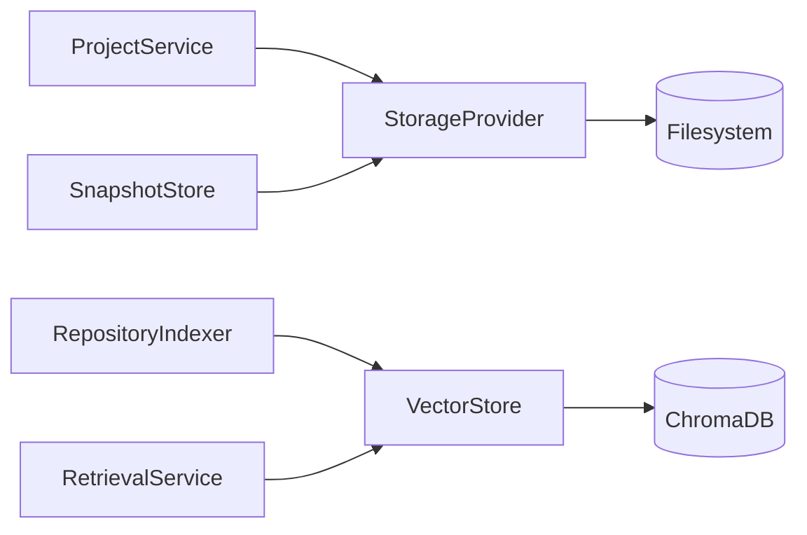

# Storage Subsystem

> **Status:** Complete
> **Sprint Introduced:** Sprint 4
> **Last Updated:** Sprint 12.1
> **Reading Time:** 3 minutes
> **Audience:** Backend contributors
> **Prerequisites:** [System Overview](../system-overview.md)
> **Related ADRs:** ADR-0006, ADR-0010
> **Next Reading:** [Frontend](../frontend/overview.md)

---

## Executive Summary

The Storage subsystem provides durable persistence for all application state. It owns the persistence mechanisms — not the business logic. Two storage abstractions exist: `StorageProvider` for filesystem-based data and `VectorStore` for vector data.

---

## Responsibilities

- Filesystem-based project metadata persistence
- Snapshot persistence (pre-edit file state)
- Configuration persistence
- Vector database persistence (via ChromaDB adapter)

---

## Ownership Boundaries

| Owned | Not Owned |
|-------|-----------|
| Filesystem I/O | Repository understanding |
| Vector persistence | Semantic search logic |
| Storage abstraction interfaces | Embedding generation |
| Configuration persistence | Business rules |
| — | Any form of business logic |

---

## Architecture

---

## Key Files

### StorageProvider (Interface)

- **File:** `app/core/storage/abstractions.py`
- Abstract persistence interface for project state and snapshots

### FileSystemStorage

- **File:** `app/core/storage/filesystem.py`
- Default implementation using the local filesystem
- Root directory configured via `settings.storage.root_directory`

### VectorStore (Interface)

- **File:** `app/indexing/stores.py`
- Abstract vector persistence interface
- Methods: `index(chunks)`, `find_similar(embedding, limit) -> list[SearchHit]`

### ChromaVectorStore

- **File:** `app/indexing/chroma_store.py`
- ChromaDB adapter implementing `VectorStore`
- Configuration via `settings.chroma`

---

## Invariants

> [!IMPORTANT]

1. **Storage never contains business logic.** It reads and writes data — it does not interpret it.
2. **Storage never performs repository reasoning or AI inference.**
3. **Vector search is delegated to `VectorStore`.** Storage owns persistence, search is a service provided by the store.
4. **Filesystem storage is the single source of truth for project metadata.**

---

## Extension Points

| Point | Mechanism | Example |
|-------|-----------|---------|
| Storage backend | Implement `StorageProvider` | Cloud storage, database |
| Vector store | Implement `VectorStore` | PostgreSQL pgvector, Pinecone |

> [!TIP] To add a new vector store: implement `VectorStore` and update the provider function in `providers.py`. No indexing or retrieval code changes are required beyond configuration.

---

## Why This Design

Two separate abstractions exist because filesystem and vector storage have fundamentally different usage patterns. Filesystem storage is used for small, structured metadata (projects, snapshots). Vector storage handles large, unstructured embedding data with similarity search requirements. Merging them would create a leaky abstraction.

---

## Known Limitations

- No database migration system — filesystem storage uses JSON format
- ChromaDB version pinned to 0.1.0.20 — upgrades may require adapter changes
- `VectorStore` interface combines read and write — separating them could improve testability

---

## Related Documents

| Document | Link |
|----------|------|
| Project Management | [project-management.md](project-management.md) |
| Indexing | [indexing.md](indexing.md) |
| Retrieval | [retrieval.md](retrieval.md) |
| Editing | [editing.md](editing.md) |
| ADR-0006 | [../../adr/adr-0006-chromadb-vector-store.md](../../adr/adr-0006-chromadb-vector-store.md) |
| ADR-0010 | [../../adr/adr-0010-filesystem-persistence.md](../../adr/adr-0010-filesystem-persistence.md) |
