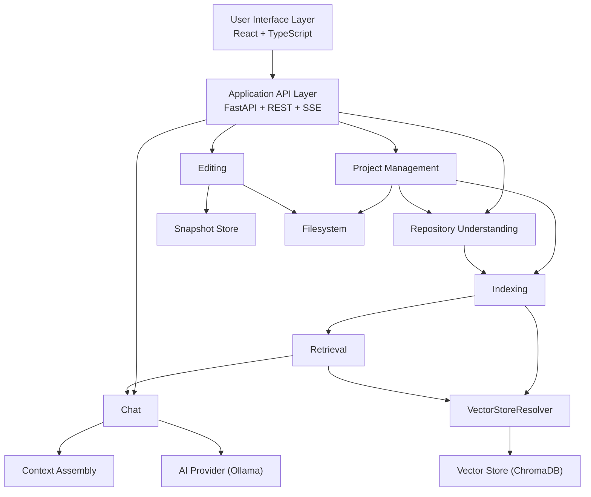
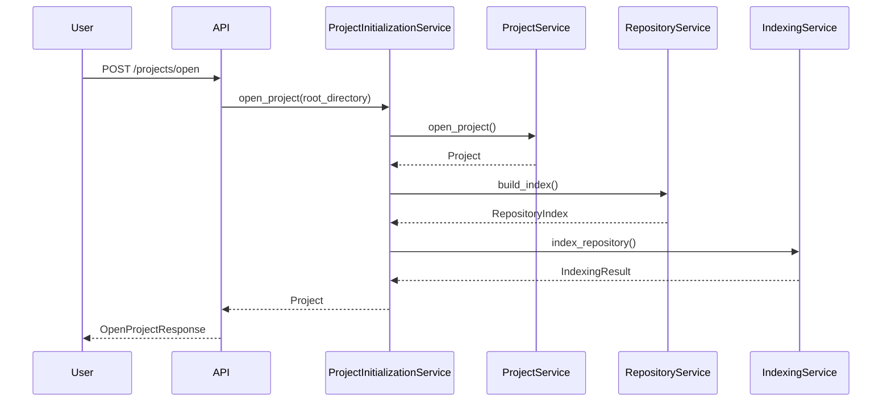
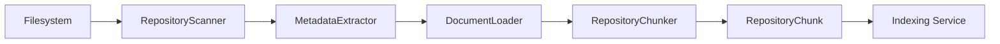
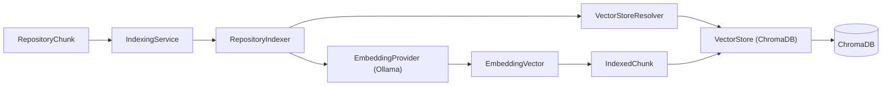
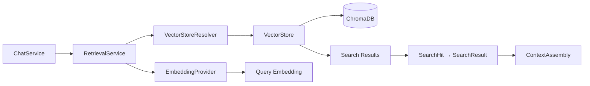
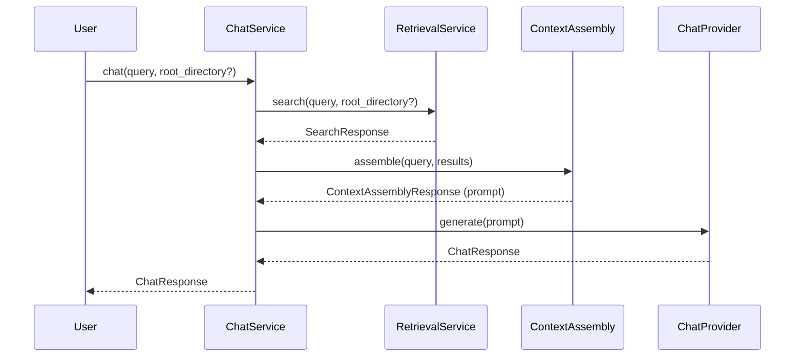
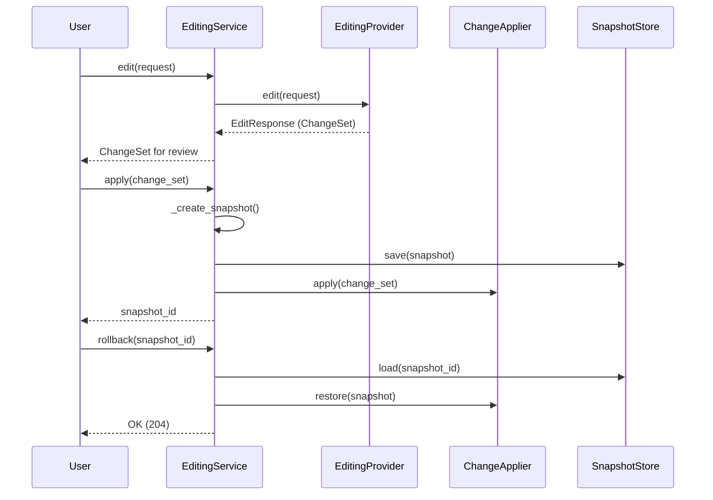
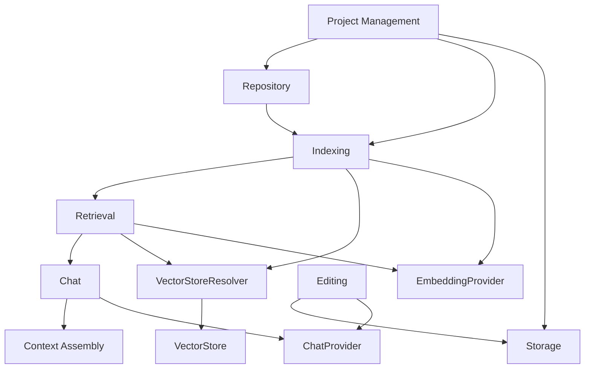
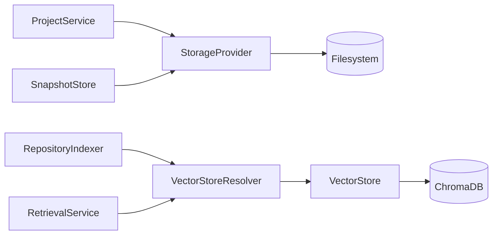

# Reusable Architecture Diagrams

> **Status:** Complete
> **Last Updated:** Sprint 13

---

This directory contains reusable Mermaid diagrams. Subsystem documentation references these by including them inline or linking to the pattern.

## How to Use

Copy the relevant diagram block into any `.md` file. Mermaid is rendered natively by GitHub.

## Available Diagrams

### System Architecture

### Project Open Lifecycle

### Repository Pipeline

### Indexing Pipeline

### Retrieval Pipeline

### Chat Pipeline

### Editing Pipeline

### Subsystem Dependencies

### Storage Relationships

---

## Related

| Document | Link |
|----------|------|
| System Overview | [../system-overview.md](../system-overview.md) |
| Project Management | [../backend/project-management.md](../backend/project-management.md) |
| Repository | [../backend/repository.md](../backend/repository.md) |
| Indexing | [../backend/indexing.md](../backend/indexing.md) |
| Retrieval | [../backend/retrieval.md](../backend/retrieval.md) |
| Chat | [../backend/chat.md](../backend/chat.md) |
| Editing | [../backend/editing.md](../backend/editing.md) |
| Storage | [../backend/storage.md](../backend/storage.md) |
