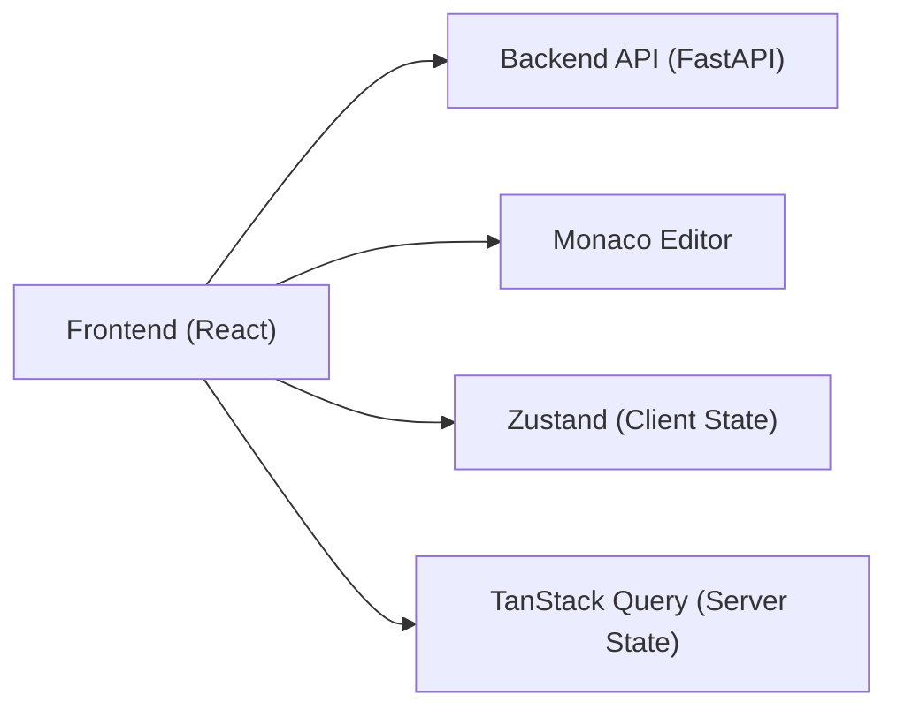

# Frontend Architecture

> **Status:** Complete
> **Sprint Introduced:** Sprint 4
> **Last Updated:** Sprint 12.1
> **Reading Time:** 3 minutes
> **Audience:** Frontend contributors
> **Prerequisites:** [System Overview](../system-overview.md)
> **Previous Reading:** [Storage](../backend/storage.md)

---

## Executive Summary

The frontend provides the user-facing interface for Repository Intelligence Platform. It owns presentation only — no repository understanding, indexing, or retrieval runs in the browser. All domain logic executes on the backend.

---

## Technology Stack

| Layer | Technology |
|-------|-----------|
| Framework | React + TypeScript |
| Build | Vite |
| State | Zustand |
| Server State | TanStack Query |
| Editor | Monaco Editor |
| API | Fetch / HTTP |

---

## Responsibilities

- User interaction and presentation
- Project management UI (open, info)
- Chat interface (query, response, streaming)
- Repository browsing (index, entries)
- Diff visualization
- Code editing
- API communication
- Client-side state management

---

## Ownership Boundaries

| Owned | Not Owned |
|-------|-----------|
| UI rendering | Repository scanning |
| User input handling | Metadata extraction |
| Client state | Semantic indexing |
| API communication | Embedding generation |
| Editor integration | Vector search |
| — | Repository modification |

---

## Architecture

---

## Key Files

| Area | Technology |
|------|-----------|
| UI Framework | React + TypeScript |
| Build Tool | Vite |
| State Management | Zustand |
| Server State | TanStack Query |
| Editor | Monaco Editor |

## Key Concerns

- **Offline awareness:** The frontend should handle backend unavailability gracefully (show cached state, retry).
- **Streaming support:** Chat responses should render incrementally as SSE events arrive.
- **Editor integration:** Monaco Editor provides code display and editing. Changes submitted to the backend for application.

---

## Invariants

> [!IMPORTANT]

1. **No domain logic in the frontend.** The frontend renders, requests, and displays — it never processes repository data.
2. **All business operations go through the API.** Direct filesystem access from the browser is not permitted.
3. **The frontend is a consumer of the API contract.** API changes must be backward-compatible or versioned.

---

## Extension Points

- New UI features: add React components that consume existing API endpoints
- New API integrations: add TanStack Query hooks for new endpoints

---

## Related Documents

| Document | Link |
|----------|------|
| System Overview | [../system-overview.md](../system-overview.md) |
| API Reference | [../../api/](../../api/) |
