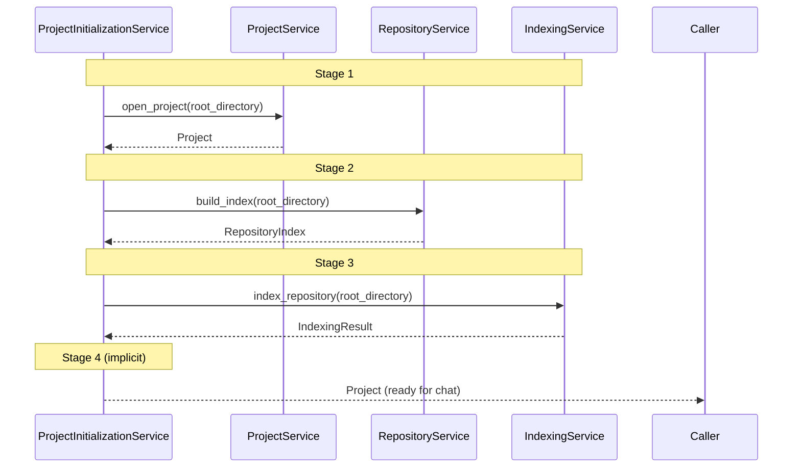

# Repository Lifecycle

> **Status:** Complete
> **Sprint Introduced:** Sprint 12.1
> **Last Updated:** Sprint 13
> **Reading Time:** 3 minutes
> **Audience:** All contributors
> **Prerequisites:** [System Overview](system-overview.md)
> **Related ADRs:** ADR-0011, ADR-0013, ADR-0014, ADR-0010

---

## Executive Summary

A repository transitions through four stages from opening to chat-ready. Each stage is owned by a single service. The lifecycle is sequential — each stage must complete before the next begins.

---

## Lifecycle Stages

### Stage 1: Project Open

**Owner:** `ProjectService`

**Actions:**
- Resolve the root directory path
- Validate that the directory exists and is accessible
- Construct a `Project` object (name, root_directory, storage_directory)
- Persist project metadata to `<root>/.local_openclaw/project.json`

**Output:** `Project` domain model

**Error states:**
- Directory does not exist → `InvalidProjectError`
- Path is not a directory → `InvalidProjectError`

### Stage 2: Index Build

**Owner:** `RepositoryService`

**Actions:**
- Scan the directory tree via `RepositoryScanner`
- Enrich each entry with fast metadata (MIME type, language, size)
- Compute a `RepositorySummary` (file count, directory count, total size)

**Output:** `RepositoryIndex` (summary + entries)

**Invariants:**
- Scanning is stateless — results are computed fresh each call
- Uses `enrich_fast()` path only — no SHA-256 hashing

### Stage 3: Repository Index

**Owner:** `IndexingService`

**Actions:**
- Scan the directory tree (independent scan from Stage 2 — see ADR-0014)
- Enrich each entry with full metadata (including SHA-256)
- Filter to text files only
- Load document content
- Chunk documents (AST-aware for Python, line-based for others)
- Generate embeddings via `OllamaEmbeddingProvider`
- Resolve and persist vectors through `VectorStoreResolver` → `ChromaVectorStore` at `<root>/.local_openclaw/index/chroma`

**Output:** `IndexingResult` (scanned, indexed, skipped, failed counts)

**Persistence identity (Sprint 13):** the Chroma store is resolved from the opened project root, never from the process working directory. Starting the backend from any directory yields the same store for the same project.

**Error handling:**
- Failed files are counted but do not abort the process
- Non-text files are skipped silently

### Stage 4: Repository Ready

**Owner:** (implicit — no single service)

**Preconditions:**
- Project metadata is persisted (Stage 1)
- Repository index is built (Stage 2)
- Embeddings are stored and searchable (Stage 3)

**Capabilities enabled:**
- `RetrievalService.search()` returns meaningful results
- `ChatService.chat()` assembles repository context
- `GET /repository/index` returns scan data
- `GET /repository/scan` returns entries

---

## Orchestration

---

## State Summary

| Stage | Service | Output | Persistence | Reversible |
|-------|---------|--------|-------------|------------|
| 1. Project Open | `ProjectService` | `Project` | `.local_openclaw/project.json` | Manual delete |
| 2. Index Build | `RepositoryService` | `RepositoryIndex` | In-memory only | Re-scan |
| 3. Repository Index | `IndexingService` | `IndexingResult` | ChromaDB vectors at `<root>/.local_openclaw/index/chroma` | Re-index |
| 4. Ready | — | — | All of the above | Re-open |

---

## Known Issues

- Stage 2 and Stage 3 both scan the filesystem independently (duplicate I/O). See [ADR-0014](../adr/adr-0014-repository-scan-ownership.md).
- There is no explicit state machine — the sequence is enforced by `ProjectInitializationService.open_project()`.
- No caching or incremental indexing — every open is a full re-index.

---

## Related Documents

| Document | Link |
|----------|------|
| Project Management | [backend/project-management.md](backend/project-management.md) |
| Repository | [backend/repository.md](backend/repository.md) |
| Indexing | [backend/indexing.md](backend/indexing.md) |
| System Overview | [system-overview.md](system-overview.md) |
| ADR-0011 | [../adr/adr-0011-repository-lifecycle.md](../adr/adr-0011-repository-lifecycle.md) |
| ADR-0014 | [../adr/adr-0014-repository-scan-ownership.md](../adr/adr-0014-repository-scan-ownership.md) |
