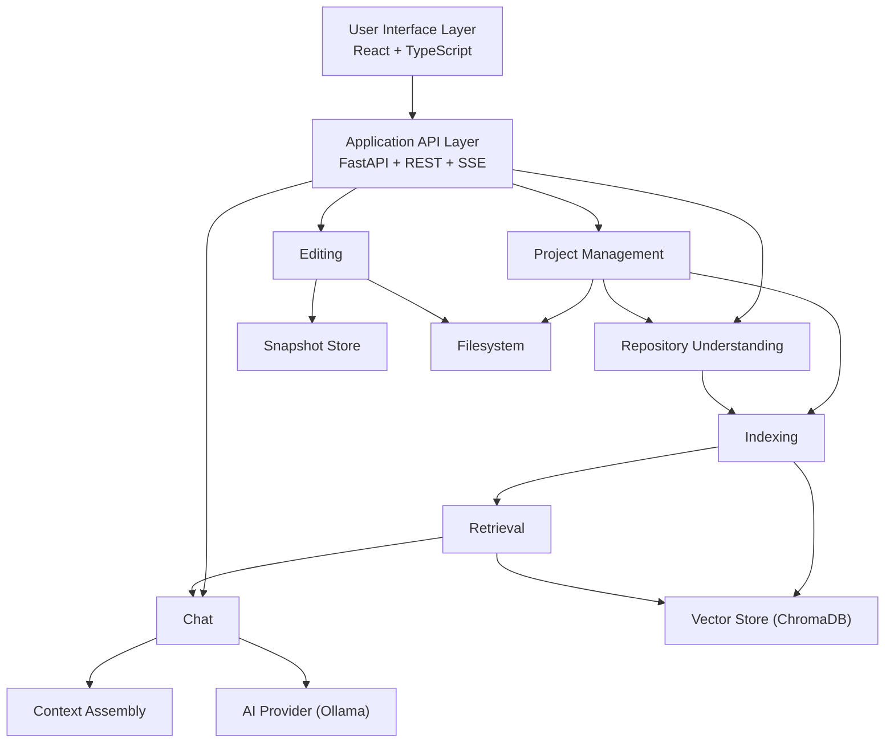
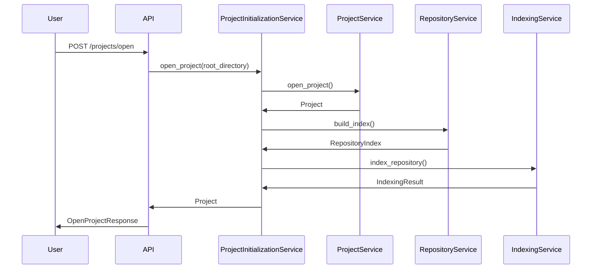

# System Architecture

> **Status:** Complete
> **Sprint Introduced:** Sprint 4
> **Last Updated:** Sprint 12.1
> **Reading Time:** 4 minutes
> **Audience:** All contributors
> **Prerequisites:** [Vision](../../vision/README.md)

---

## Executive Summary

Repository Intelligence Platform is organized as a collection of well-defined subsystems, each owning a single architectural responsibility. Communication occurs only through stable public contracts. The architecture follows a layered approach: repository understanding forms the foundation upon which indexing, retrieval, chat, and editing are built.

Core characteristics: offline-first, explicit subsystem ownership, stable public interfaces, filesystem-based persistence, local AI execution.

---

## Architecture Layers

---

## Subsystem Map

| Subsystem | Document | Primary Responsibility |
|-----------|----------|----------------------|
| Project Management | [backend/project-management.md](backend/project-management.md) | Project lifecycle, validation, initialization orchestration |
| Repository | [backend/repository.md](backend/repository.md) | Repository scanning, metadata extraction, chunking |
| Indexing | [backend/indexing.md](backend/indexing.md) | Embedding generation, vector persistence |
| Retrieval | [backend/retrieval.md](backend/retrieval.md) | Semantic search over indexed content |
| Chat | [backend/chat.md](backend/chat.md) | Repository-aware conversational AI |
| Editing | [backend/editing.md](backend/editing.md) | Controlled code modification with rollback |
| Storage | [backend/storage.md](backend/storage.md) | Filesystem and vector persistence |
| Frontend | [frontend/overview.md](frontend/overview.md) | User interface and presentation |

---

## Core Data Flow

---

## Architectural Invariants

> [!IMPORTANT] The following rules must never be violated.

1. **Subsystem ownership is exclusive.** No two subsystems own the same responsibility.
2. **Dependency direction is downward.** Repository → Indexing → Retrieval → Chat. Editing is parallel.
3. **Chat never indexes.** `ChatService` consumes retrieval but never performs indexing.
4. **Retrieval never indexes.** `RetrievalService` performs search only.
5. **Storage never contains business logic.** Storage owns persistence mechanisms only.
6. **ProjectInitializationService orchestrates only.** It delegates all work and contains no business logic.

---

## Related Documents

| Document | Link |
|----------|------|
| Architecture Evolution | [evolution.md](evolution.md) |
| Backend Subsystems | [backend/](backend/) |
| Frontend | [frontend/overview.md](frontend/overview.md) |
| ADR Index | [adr/](../../adr/README.md) |
| Glossary | [reference/](../../reference/) |
