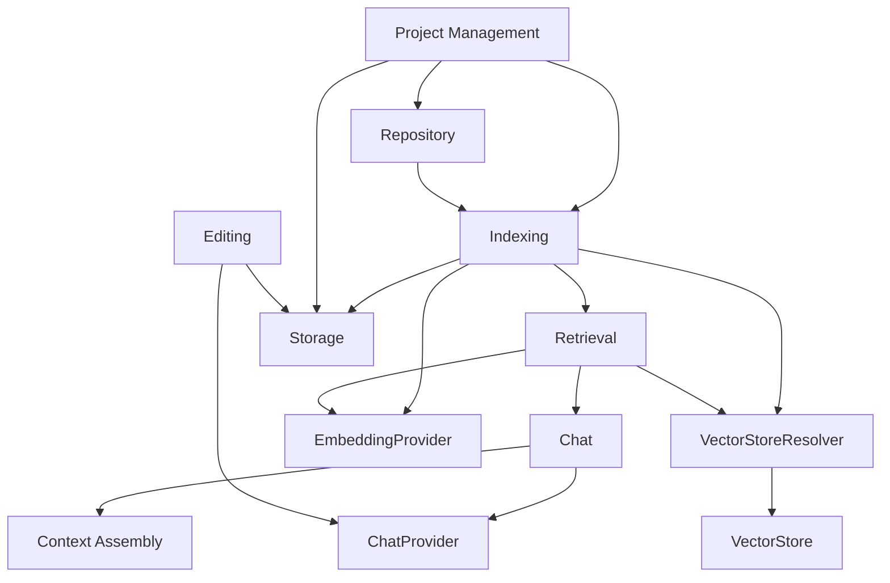

# Dependency Map

> **Status:** Complete
> **Last Updated:** Sprint 13

---

## Subsystem Dependencies

## Allowed Dependencies

| Subsystem | May Depend On |
|-----------|--------------|
| Project Management | Repository, Indexing, Storage |
| Repository | (nothing — foundational) |
| Indexing | Repository, Storage, EmbeddingProvider, VectorStoreResolver |
| Retrieval | EmbeddingProvider, VectorStoreResolver |
| Chat | Retrieval, ContextAssembly, ChatProvider |
| Context Assembly | (nothing — stand-alone) |
| Editing | Storage, ChatProvider |
| Storage | (nothing — stand-alone) |
| Frontend | Backend API |

## Forbidden Dependencies

> [!WARNING] The following dependencies must never exist.

- Chat → Indexing (chat never indexes)
- Retrieval → Indexing (retrieval never indexes)
- Indexing → Retrieval (indexing never searches)
- Repository → anything (repository is foundational)
- Storage → any business logic subsystem (storage never interprets data)
