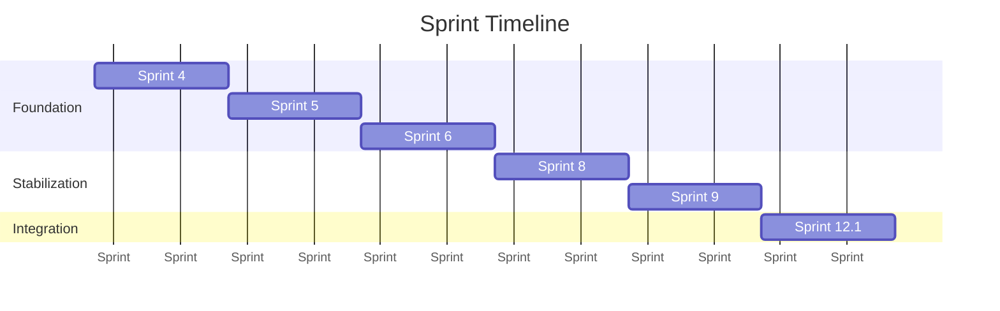

# Project Timeline

> **Status:** Complete
> **Last Updated:** Sprint 12.1
> **Reading Time:** 3 minutes
> **Audience:** All contributors

---

## Executive Summary

Architectural evolution of Repository Intelligence Platform, organized by sprint. Each sprint delivered a vertical slice of capability while preserving subsystem boundaries.

---

## Timeline

## Sprint Detail

### Sprint 3 (Pre-Foundation)

*Initial project scaffolding. No documentation preserved in current hierarchy.*

### Sprint 4 — Repository Indexing

**Objective:** Establish core repository understanding and deterministic chunking.

**Delivered:**
- Repository subsystem (scanner, metadata extractor, document loader, chunker)
- AST-aware Python chunking with line-based fallback
- Deterministic chunk identifiers (SHA-256)
- ChromaDB vector store adapter
- Indexing subsystem (embedding, vector persistence)
- `EmbeddingProvider` and `VectorStore` interfaces
- `ProjectService` (project lifecycle)
- Documentation set (Docs 0–5 in Info docs/)

**Key ADRs:** 0001, 0002, 0003, 0006, 0010, 0015

### Sprint 5 — Retrieval

**Objective:** Introduce semantic search over indexed repository content.

**Delivered:**
- Retrieval subsystem (`RetrievalService`)
- `SearchQuery`, `SearchHit`, `SearchResult`, `SearchResponse`
- Repository indexer and indexing orchestration
- Retrieval decoupled from indexing

**Key ADRs:** 0004, 0008, 0016

### Sprint 6 — Chat

**Objective:** Introduce repository-aware conversational AI.

**Delivered:**
- Chat subsystem (`ChatService`)
- Context assembly (`DefaultContextAssembly`)
- `ChatPrompt`, `ChatMessage`, `ChatRole` models
- `ChatProvider` interface with Ollama implementation
- Chat API endpoints

**Key ADRs:** 0007, 0012, 0017

### Sprint 8 — Rollback

**Objective:** Safe editing with snapshot-based rollback.

**Delivered:**
- Editing subsystem (`EditingService`)
- `ChangeApplier` for safe file modification
- `SnapshotStore` for pre-edit state capture
- Rollback capability
- Editing API endpoints

### Sprint 9 — Stabilization

**Objective:** Cross-subsystem stabilization and boundary hardening.

**Delivered:**
- Centralized dependency injection in `providers.py`
- Subsystem boundary enforcement
- Validation gates established (Ruff + MyPy + Pytest)
- Public interfaces frozen for V1

**Key ADRs:** 0005

### Sprint 12.1 — ProjectInitializationService

**Objective:** Automate project initialization on open.

**Delivered:**
- `ProjectInitializationService` orchestration layer
- `open_project()` calls `ProjectService` → `RepositoryService.build_index()` → `IndexingService.index_repository()`
- Provider functions for `DocumentLoader`, `Chunker`, `RepositoryIndexer`, `IndexingService`
- API endpoint updated to use orchestration service
- Documentation system restructured (current hierarchy)

**Key ADRs:** 0009, 0011, 0013, 0014

---

## Next Sprints

See [Roadmap](../roadmap/) for planned sprints 12.2 through 18.

---

## Related Documents

| Document | Link |
|----------|------|
| Architecture Evolution | [../architecture/evolution.md](../architecture/evolution.md) |
| Roadmap | [../roadmap/](../roadmap/) |
| Sprint 12.1 | [../sprints/sprint-12.1.md](../sprints/sprint-12.1.md) |
| ADR Index | [../adr/](../adr/README.md) |
